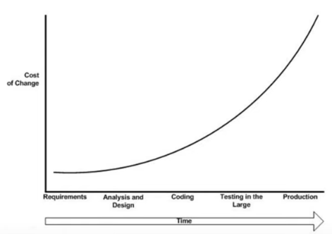

# MLOps thoughts - 5W1H

> **Thoughts on Machine Learning Ops - Why, What, Where, Who, When, How**

## Table of contents
1. [Why?](#why)
    * [Why this doc?](#why-doc)
    * [Why MLOps?](#why-mlops)
2. [What?](#what)
3. [Where?](#where)
4. [Who?](#who)
5. [When?](#when)
6. [How?](#how)
7. [References](#references)

## 1. Why? 

### 1.1. Why this doc? 

#### Personal motivation

I've been receiving a lot of `5W1H` (Why, What, Where, Who, When, How) questions about Machine Learning Ops (**MLOps**). This triggered me to revisit important references on the subject, and go through discussions about it (with friends, and on LinkedIn/Reddit). So, in this space, I try to organize my thoughts around the subject focusing on `5W1H`.

Another motivation is just because I love writing and never dared to elaborate a document in this format: structured thoughts around the foundations of a subject combined with real-life experience and nuances.

#### "Standing on the shoulders of giants"

Here, I try my best to not reinvent the wheel by heavily relying on the [references](#references), and structuring my thoughts upon them --- special highlight to [The Google document entitled "MLOps: Continuous delivery and automation pipelines in machine learning"](https://cloud.google.com/architecture/mlops-continuous-delivery-and-automation-pipelines-in-machine-learning) 

### 1.2. Why MLOps? 

#### Quick Data/ML context 

I try not to spend much on "Data is new oil" here --- in short: there is a huge amount of data for every area nowadays, and there has been a significant shift in tech to extract knowledge and insights from such data in an automatic and intelligent fashion.

#### Technical debt and MLOps 

When starting such shift, there are usually just a few Data/ML-focused people for every enterprise. It's always somewhat risky to change from the "traditional way of doing things", so quick positive results from Proof-of-Concepts (through offline evaluation and online A/B testing) are always welcome. And, if such results are indeed positive, the natural will is to go live with this proposed approach as soon as possible. Through the course of this (fictional, but possibly real) process, most steps from experimentation to deployment and monitoring are performed manually (**MLOps level 0**), "hacking" the code so it works as expected this one time. Then, every time there is a maintenance and/or feature development, it can be painful and time consuming --- which is related to the **technical debt** concept --- instead of joyful and effective. MLOps takes care of the aforementioned issues. 

## 2. What? 

> "I get the context and why MLOps; but *what* is MLOps?"

More than tech stack & tooling, **MLOps is very much about culture and process**, [as well put by Eduardo Bonet](https://www.linkedin.com/feed/update/urn:li:activity:6922731393760284672?commentUrn=urn%3Ali%3Acomment%3A%28activity%3A6922731393760284672%2C6922901241454850049%29) in this interesting discussion on LinkedIn raised by Cassie Kozyrkov ([link](https://www.linkedin.com/posts/kozyrkov_what-do-most-people-misunderstand-about-mlops-activity-6922731393760284672-74tx?utm_source=linkedin_share&utm_medium=member_desktop_web)):

> *... similar to DevOps, MLOps is not (only) about the stack, it is instead about **the culture of how to deliver results better and faster on systems that use Machine Learning. It's about processes, and the tools necessary to support these processes**. MLOps starts much before deployment, starts already on creating processes to identify the right problems to solve, then finding the best processes and stack to allow fast interation when creating, packaging these models, deploying, securing, and then monitoring the models.*

Complementing the quote above, MLOps is usually about understanding, organizing and solving the whole Machine Learning Engineering (MLE) puzzle. In a practical sense, MLE /MLOps efforts are about automating whatever is possible in Machine Learning-based systems and projects, by
* making systems and modules **easier to understand, more flexible, more maintainable, and highly and easily configurable**,
* properly **tracking artifacts** along the ML pipeline,
* brainstorming when analysisng requirements and continuously discussing **best practices** to employ the **S.O.L.I.D. Principles** and **Design Patterns**, ensuring high-standard documentation and code review processes.

> The last item above is related to the positive and healthy side of *peer pressure*: to raise the technical bar so that team members are always learning from each other, not only scientifically and business-wise, but from the MLE/MLOps perspective. 

Thus making the whole process as smooth as possible, with reproducible experiments and setups, and ML(-related) software awesome --- see [References](#references) for some resources around the above items --- highlight to ["S.O.L.I.D. Principles for Machine Learning Engineers" YouTube playlist](https://www.youtube.com/watch?v=ul8LLiFY0Dw&list=PL-wATfeyAMNpZ6-ESiXK9BnZmGLjqECt9)

> This last paragraph could be a good hook to the [`How?`](#how) section. But first, I would like to first cover [`Where?`](#where) very briefly; and then address the "time degradation effect" on long-term efforts when compared to the short-term. Although this last paragraph sounds quite appealing in the long-term and engineering-wise, these efforts can be hard to prioritize in real-world scenarios with lots of low-hanging fruits, maintenance (mostly due to technical debt), and the current high-rotation of ML/Data people -- which seems to be a perfect link to the [`When?`](#when) and [`Who?`](#who) sections, respectively.

## 3. Where? 

MLOps practices must start somewhere. The Machine Learning Engineering (MLE) role is fresher than other data roles, so MLEs have been gradually joining Data/ML intensive teams. 

> Most ML/Data intensive companies have been focusing on building up ML & Data platforms teams. 

In practice, there are "known gray areas" and/or overlaps when performing Data/ML related roles. The building up of MLOps culture and processes are excessively time and effort consuming to build from the inside-out (individual-team-company). That's why most ML/Data intensive companies have been focusing on building up **ML & Data platform teams**. In that sense, such teams cover most of the tooling, processes and culture in a horizontal fashion, crossing all ML/Data teams throughout the company, while MLEs inside teams focus on internal MLE demands, ensuring ML-related softwares are as beautiful as possible, also filling gaps not covered in this "general efforts" provided by the platform team.

> What seems the best organizational approach has: MLEs inside teams and ML & Data platform teams, so the whole MLOps concept, process and culture can converge properly.

## 4. Who? 

#### Machine Learning Engineers (MLEs)

At this point, I just recap from last section that it is possible to roughly divide MLEs into two kinds of teams:

* Data/ML Platform teams
* Non-platform teams

#### Data Engineers (DEs)

Data Engineers and MLEs are partners in the Engineering endeavor at Data/ML projects. In a superficial and short fashion, DEs are more concerned with the ETL (Extract, Transform, Load), while MLEs focus more on engineering aspects more closely related to ML itself (again, there is always overlap and gray areas).

#### Data Scientists (DSs)

One of the quotes that I heard the most in Machine Learning Engineering environments is that:
> the MLE's job should be to make Data Scientists life easier

...so that DSs would have an easier time experimenting, deploying and presenting business/product results. 

#### Engineering Managers and Tech Leads

From the perspective of Engineering Manager and Tech Lead, improving tech health in the long-term by automating processes and getting rid of technical debt is quite positive and appealing.

#### Data (Science) Chapter/Department

It is the organizational branch/entity which has the guidelines for everything Data-related. ML/Data platform team(s) are usually under this organizational structure, as well as the main evangelist(s) of the MLOps culture.

#### Product Owners

Enabling data-related results to be delivered faster implies in faster delivery of business value. However, that requires long-term efforts, and projects need to keep thriving in the short-term. This discussion will be addressed in [Pursuing the middle path](#balance), but, before diving into [`How?`](#how), this moment seems suitable to explore [`When?`](#when).

## 5. When? 

As discussed in the [Technical debt and why MLOps](#tech_debt) subsection, ideally, MLOps processes should be in place right from the start, while defining the requirements, before designing the system(s). This is possible when assembling new teams and projects. As seen in the Figure below, changing softwares in production has a much higher cost, in general. For existing projects starting to grow MLOps-wise, it is important to understand the big picture of the product and tech architecture, identify the most critical points to take care of the technical debt, and make continous refactoring progress, to gradually evolve with regard to MLOps levels --- more details on this discussion on the next section.

## 6. How? 

Since this a very open question, I would like to attain to real-world scenarios I've seen and worked on, in an attempt to inspire others and give straightforward examples --- please check the [reference](#reference) material for a more broad understanding of all possibilities. 

#### MLOps levels and (some of the) concepts

["MLOps: Continuous delivery and automation pipelines in machine learning" Google doc](https://cloud.google.com/architecture/mlops-continuous-delivery-and-automation-pipelines-in-machine-learning) presents MLOps levels. ML-related systems should focus to gradually progress from one level to another.
* MLOps level 0: Manual process
* MLOps level 1: ML pipeline automation (most of the times related to an Airflow-like tool)
* MLOps level 2: CI/CD pipeline

In real-life, it gets fuzzy which steps are automated or not, and most systems are not exactly on a certain level, but we will stick with the `int` values for levels, for simplicity's sake.

To reach MLOps level 1, we need to encapsulate/modularize every step of a ML pipeline, so that for each of them we have work with: 
* one main config file with all the necessary specifications as input,
* and a set of artifacts as output.

Examples of:
* Steps: data gathering, data preparation, model training, offline model evaluation, load test, A/B testing, deploy in pro, monitoring
* Artifacts: transformed data, trained model, offline evaluation report

> [The Strategy Design Pattern fits greatly in here](https://refactoring.guru/design-patterns/strategy).

With that done, we could have an orchestrator to ensure every step is processing accordingly, by providing the necessary config files and checking the expected artifacts. This (1) improves tracking of experiments (reproducibility), (2) make it easier to set up experiments and deliver results, (3) decrease technical/documentation debt by increasing reusability through well-defined processes.

#### Best practices vs deliverables: Pursuing the middle path 

"Slow and steady wins the race": to invest time and effort on MLOps pays off in the long-term. However, projects need short-term evidence of evolution to keep thriving. So we are usually persuing the middle path where we set up the systems with the best practices possible at that moment --- avoiding over-engineering, but making it as good as possible to maintain and evolve in the future. Cross-company MLOps culture, and a good and healthy relationship between product and engineering supports this pursue for the right balance.

#### New non-platform projects

As discussed mostly in section [When?](#when), it is good to start a ML-related project discussing processes from the MLOps perspective. Most of the time the tech stack is defined before-hand, so we would think about the steps, the pipeline, and the orchestrator in a compatible and well-structured way --- and possibly build up the optimal alternative for such project. 

#### Existing non-platform projects

Here, it regurlaly takes significant effort to understand the whole ML ecosystem and then start refactoring and working to level MLOps up. 
It varies a real deal depending on the context, team, project. One of the most critical bottlenecks is usually related to (re)training and (re)deploying, to keep always the most updated model in production in the smoothest way possible. So, if these tasks are not automated, this would be a good starting point in a practical sense. From here on, the priority should accord to the teams' interests and goals. If suitable, it should be good to establish a well defined process for A/B testing in the smoothest way possible. Some other interesting examples to work on could be to have offline evaluation incorporated in the CI/CD pipeline --- every time we develop a new feature, we automatically generate the offline evaluation after the training step (and hyperparameter optimization, analogously). In a fictional project, where we have all other critical automations and best practices in place, we could a have a retraining setup ready to be triggered once we detect a kind of drift while checking the artifacts. 

## 7. References 
* ["Hidden Technical Debt in Machine Learning systems" paper](https://proceedings.neurips.cc/paper/2015/file/86df7dcfd896fcaf2674f757a2463eba-Paper.pdf)
* ["MLOps: Continuous delivery and automation pipelines in machine learning" Google doc](https://cloud.google.com/architecture/mlops-continuous-delivery-and-automation-pipelines-in-machine-learning)
* ["Gentle Introduction to MLOps" Medium post](https://medium.com/analytics-vidhya/fundamentals-of-mlops-part-1-a-gentle-introduction-to-mlops-1b184d2c32a8)
* S.O.L.I.D. Principles 
    * [Wikipedia](https://en.wikipedia.org/wiki/SOLID)
    * ["The S.O.L.I.D. Principles in pictures" Medium post](https://medium.com/backticks-tildes/the-s-o-l-i-d-principles-in-pictures-b34ce2f1e898))
* "S.O.L.I.D. Principles for Machine Learning Engineers" 
    * [YouTube playlist](https://www.youtube.com/watch?v=ul8LLiFY0Dw&list=PL-wATfeyAMNpZ6-ESiXK9BnZmGLjqECt9)
    * [GitHub repository](https://github.com/musikalkemist/solidforml/tree/main/solidforml)
* [Design Patterns](https://refactoring.guru/design-patterns)
* Most-starred GitHub repositories entitled "Awesome MLOps" (with multiple links each):
    * https://github.com/visenger/awesome-mlops
    * https://github.com/kelvins/awesome-mlops
    * https://github.com/GokuMohandas/MLOps 
* "Most common MLOps misunderstandings" discussion raised on LinkedIn by Cassie Kozyrkov ([link](https://www.linkedin.com/posts/kozyrkov_what-do-most-people-misunderstand-about-mlops-activity-6922731393760284672-74tx?utm_source=linkedin_share&utm_medium=member_desktop_web))
